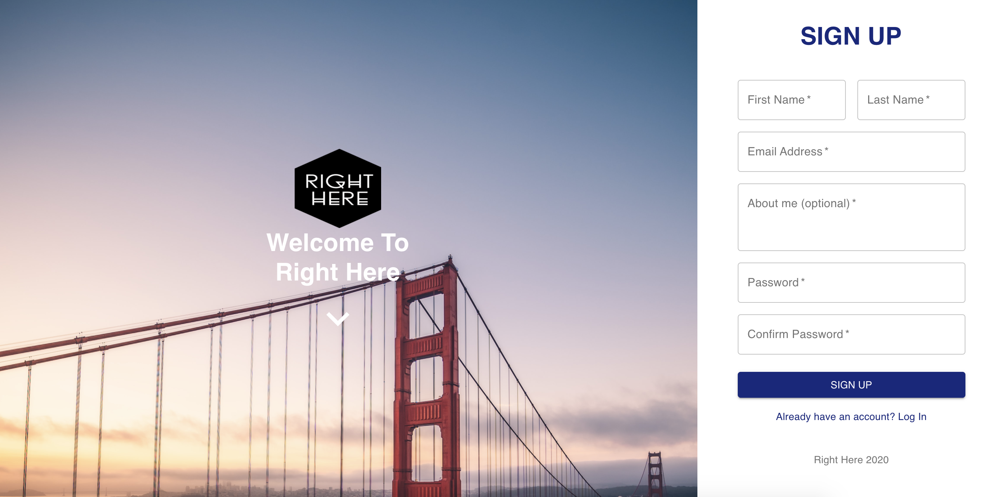
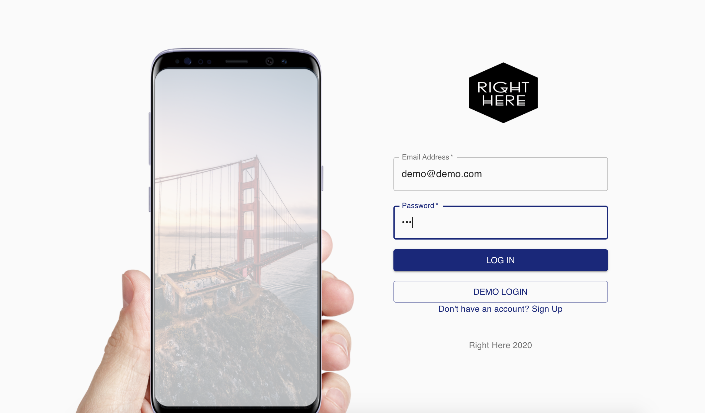
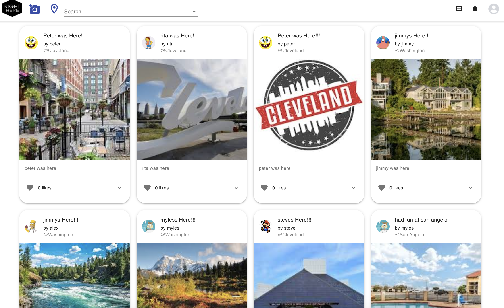
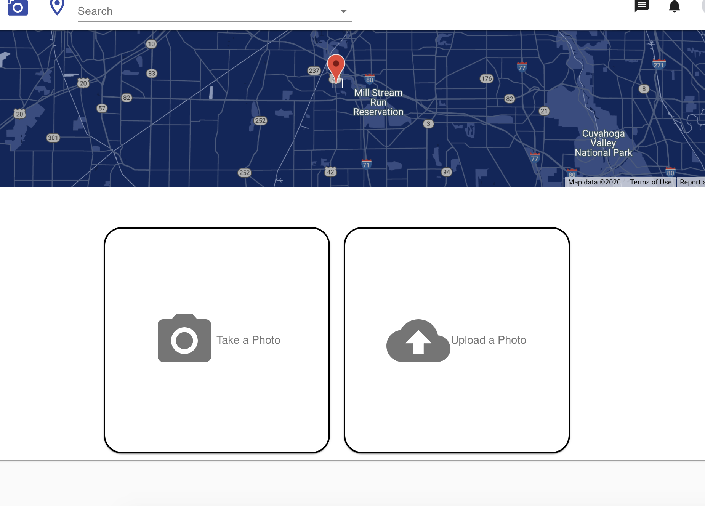
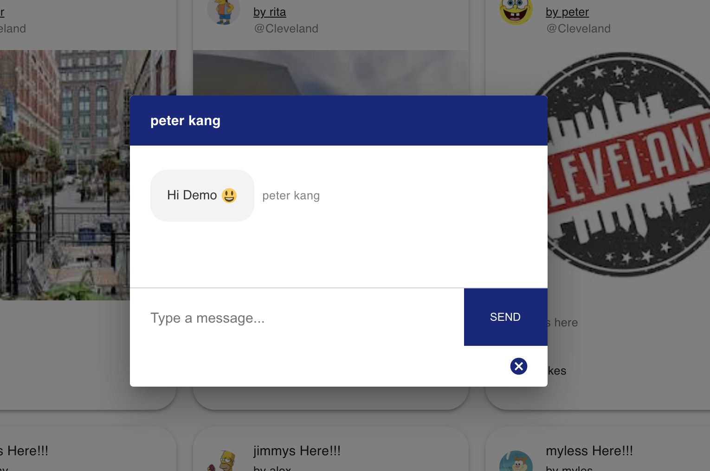

[![LinkedIn][linkedin-shield]][linkedin-url]
<br>
[Live Site](https://aa-righthere.herokuapp.com/)

<!-- PROJECT LOGO -->
<br />
<p align="center">
    <a target="_blank" rel="noopener noreferrer" href="https://aa-righthere.herokuapp.com/">
    
  </a>
    <a target="_blank" rel="noopener noreferrer" href="https://aa-righthere.herokuapp.com/">
  <h3 align="center">Right Here</h3>
  </a>

</p>


<!-- TABLE OF CONTENTS -->
<details open="open">
  <summary><h2 style="display: inline-block">Table of Contents</h2></summary>
  <ol>
    <li>
      <a href="#about-the-project">About The Project</a>
      <ul>
        <li><a href="#technical-stack">Technical Stack</a></li>
        <li><a href="#introduction">Introduction</a></li>
        <li><a href="#mvp">MVP</a></li>
      </ul>
    </li>
    <li>
      <a href="#getting-started">Getting Started</a>
      <ul>
        <li><a href="#prerequisites">Prerequisites</a></li>
        <li><a href="#installation">Installation</a></li>
      </ul>
    </li>
    <li><a href="#usage">Usage</a></li>
    <li><a href="#api-frontend">API Frontend</a></li>
    <li><a href="#api-backend">API Backend</a></li>
    <li><a href="#redux-state-structure">Redux State Structure</a></li>
  </ol>
</details>


<!-- ABOUT THE PROJECT -->
## About The Project
*Interactive splash page on the left with easy sign up on the right.

*Login options with demo login

*Renders all the post with search bar on the top that can search users and places.

*Renders all the places that have been created by users.

*Can upload photo using device's camera or simply drag and drop a file.

*Can send message to friends


### Technical Stack

* The project runs a React/Redux front end with google map react and react webcam packages
* It has socket io that allows users to chat each others.
* The Backend uses Express and S3 with postgreSQL.


### introduction


  The Right Here is a location driven photo sharing app. This app will provide the user the ability to take a photo using their device or upload a photo directly from their device and save it with the user's current location and share with other users. Users can add each other as friend and they can message to each others. Users can also search for other users and places.


### MVP
the MVP for this website encompasses the following:

1.  Places
    1. Ability to search places using user's current location
    2. create the place using current location.
    3. add a marker("i was here") in that place
    4. show all the markers within certain distance of that place.
    5. can edit the name of the place
    5. can delete the place with all the markers in side
2.  Post
    1. Ability to create Post using user's current location(place) and the picture that was provided
    2. add description and name
    3. show all the Post near by (within the location)
    4. can edit and delete the marker
3. Picture
    1. Can update place, Post, profile picture
4. Relationship
    1. Can create a relationship with other users (friend)
    2. only connected users can message to each others


<!-- GETTING STARTED -->
## Getting Started
-----------

To get a local copy up and running follow these simple steps.

### Prerequisites

Express, react, s3, google map react, react webcam...

### Installation


1. Clone the repo
   ```sh
   git clone https://github.com/southpeter77/rightHere.git
   ```
2. Install NPM packages
   ```sh
   npm install
   ```
3. Create your postgres database and connect it to the app.

4. run backend at the root level
   ```sh
   npm start
   ```
5. cd into Client directory to run frontend
   ```sh
   npm start
   ```
6. browser will open automatically.


<!-- USAGE EXAMPLES -->
## Usage
-----------

One user can enjoy a dinner at a restaurant down the street and simply post a photo and it will become a 'i was here' Post at the restaurant. Other user will be able to see the photo of the first user at the same restaurant. The first user can come back to the same street after awhile but he totally forgot about the restaurant but now he feels like he was there before and try so hard to remember why. Using this app, he will easily find out about the photo he took near by his current location and see his old memory about the restaurant. 

Useful for traveling, events, festival, resturant and other special occations.

## API Frontend
--------------------------
|Path|HTTP Verb|Meaning|
|-|-|-|
|/|GET|Show Splash Page|
|/myprofile|GET|Show my profile Page|
|/myprofile|POST|edit profile Page|
|/profile/id|GET|Show profile Page of id|
|/profile/id|POST|edit the user (relationship)|
|/login|GET|Show log in page|
|/login|POST|Log in a user|
|/signup|GET|Show sign up page|
|/signup|POST|sign up a user|
|/Post|GET|use camera|
|/Post|POST|save a photo ( create Post)|
|/search/places|GET|get a list of places|
|/search/places|POST|search a places|
|/search/places/Post|GET|get a list of Post|
|/search/places/Post/id|GET|get a Post of id number id|
--------------------------

## API Backend
-----------
|Path|HTTP Verb|Meaning|
|-|-|-|
|/api/login|POST|logs in a user|
|/api/signup|POST|signs in in a user|
|/api/myprofile|GET|get my profile data|
|/api/myprofile|PUT|edit my profile data|
|/api/profile/id|GET|get id's profile data|
|/api/profile/id|PUT|edit relationship of id user|
|/api/search/places|GET|get data of places near by current location|
|/api/search/places|POST|create a place data current location|
|/api/search/places|DELETE|delete a place data current location|
|/api/search/places/Post|GET|get data of Post of that place|
|/api/search/places/Post/id|GET|get data of that id's Post of that place|
|/api/search/places/Post/id|POST|create a new Post of that place|
|/api/search/places/Post/id|PUT|edit the id's Post of that place|
|/api/search/places/Post/id|DELETE|delete the id's Post of that place|


## Redux State Structure
```
state ={
  entities:{
     users:{
       byId:{
         "user1":{
           id: "user1",
           email: "email.com",
           firstName: "firstName",
           lastName: "lastName",
           biography: "biography",
           photos:["photo1", "photo2", "photo3"],
           comments:["comment1", "comment2", "comment3"],
           posts: ["post1", "post2", "post3"],
           relationships: ["relationship1", "relationship2"]
         },
       },
       allIds: []
     },
     posts:{
       byId:{
         "post1":{
           id: "post1",
           name: "name",
           description: "description",
           coordinates: "coordinates",
           user_id: "user_id",
           place_id: "place_id",
           photos: ["photo1", "photo2"],
           comments: ["comment1", "comment2"]
         },
       },
       allIds:["post1"]
     }
     places: {
       byId:{
         "place1":{
           id: "place1",
           name: "name",
           coordinates: "coordinates",
           posts: ["post1", "post2"],
           photos: ["photo1", "photo2"]
         }
       },
       allIds:["place1"]
     },
     photos: {
       byId:{
         photo1:{
           id: "photo1",
           url: "url",
           user_id: "user_id",
           post_id: "post_id",
           place_id: "place_id"
         }
       },
       allIds: ["photo1"]
     },
     relationships: {
       byId:{
         relationship1: {
           id: "relationship1",
           from_user_id: "from_user_id",
           to_user_id: "to_user_id",
           friend: "friend"
         }
       },
       allIds= ["relationship1"]
     },
     comments: {
       byId:{
         comment1:{
           id: "comment1",
           user_id: "user_id",
           post_id: "post_id",
           description: "description"
         }
       },
       allIds = ["comment1",]
     }
   },
   sessions:{
     currentUserId: "currentUserId",
     currentPostId: "currentPostId",
     currentPlaceId: "currentPlaceId",
     currentPhotoId: "currentPhotoId",
     currentCommentId: "currentCommentId",
     currentRelationshipId: "currentRelationshipId"
   },
   errors:{
     loginErrors:[],
     signUpErrors:[],
     postErrors:[],
     placeErrors:[],
     commentErrors:[],
     relationshipErrors:[]
   },
   ui:{
     signUpModual: ""
   
   }
}
```


[linkedin-shield]: https://img.shields.io/badge/-LinkedIn-black.svg?style=for-the-badge&logo=linkedin&colorB=555
[linkedin-url]: https://www.linkedin.com/in/peter-kang-129184166/

